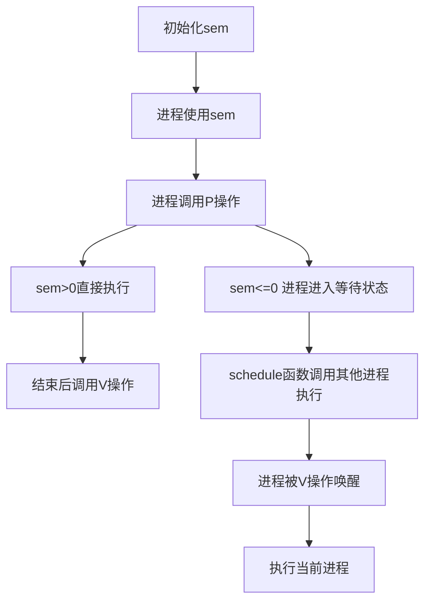
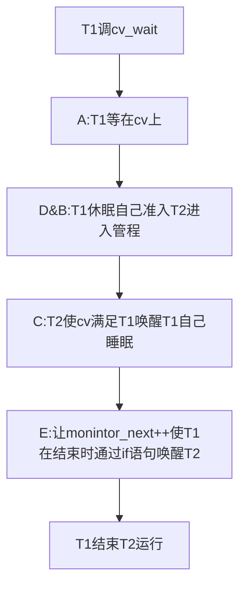

# 实验七:同步互斥

**实验目的**

- **理解操作系统的同步互斥的设计实现;**
- **解底层支撑技术:禁用中断、定时器、等待队列;**
- **在ucore中理解信号量(semaphore)机制的具体实现;**
- **理解管程机制,在ucore内核中增加基于管程(monitor)的条件变量(condition**
  **variable)的支持;**
- **了解经典进程同步问题,并能使用同步机制解决进程同步问题。**

**实验内容**

**实验六完成了用户进程的调度框架和具体的调度算法,可调度运行多个进程。如果多个进程**
**需要协同操作或访问共享资源,则存在如何同步和有序竞争的问题。本次实验,主要是熟悉**
**ucore的进程同步机制—信号量(semaphore)机制,以及基于信号量的哲学家就餐问题解决**
**方案。然后掌握管程的概念和原理,并参考信号量机制,实现基于管程的条件变量机制和基**
**于条件变量来解决哲学家就餐问题。**

**在本次实验中,在kern/sync/check_sync.c中提供了一个基于信号量的哲学家就餐问题解法。**
**同时还需完成练习,即实现基于管程(主要是灵活运用条件变量和互斥信号量)的哲学家就**
**餐问题解法。哲学家就餐问题描述如下:有五个哲学家,他们的生活方式是交替地进行思考**
**和进餐。哲学家们公用一张圆桌,周围放有五把椅子,每人坐一把。在圆桌上有五个碗和五**
**根筷子,当一个哲学家思考时,他不与其他人交谈,饥饿时便试图取用其左、右最靠近他的**
**筷子,但他可能一根都拿不到。只有在他拿到两根筷子时,方能进餐,进餐完后,放下筷子**
**又继续思考。**

## 练习0:填写已有实验

**本实验依赖实验1/2/3/4/5/6。请把你做的实验1/2/3/4/5/6的代码填入本实验中代码中**
**有“LAB1”/“LAB2”/“LAB3”/“LAB4”/“LAB5”/“LAB6”的注释相应部分。并确保编译通过。注意:**
**为了能够正确执行lab7的测试应用程序,可能需对已完成的实验1/2/3/4/5/6的代码进行进一步**
**改进。**

### `meld`:

对比`merge`的文件夹：`lab6_1 copy` &  `lab 7`

```
lab1:trap.c  kdebug.c
lab2:pmm.c default_pmm.c 
lab3:swap_fifo.c vmm.c 
lab4:proc.c
lab5:proc.c pmm.c trap.c
lab6:default_shed.c             把stride算法带进来了
```

### `update`:`trap.c`

```c
/* LAB7 YOUR CODE */
        /* you should upate you lab6 code
         * IMPORTANT FUNCTIONS:
	     * run_timer_list
         */
        ticks ++;
        assert(current != NULL);
        run_timer_list();
        break;
```

`run_timer_list()`: 调用sched_class_proc_tick(current);


## 练习1: 理解内核级信号量的实现和基于内核级信号量的哲学家就餐问题(不需要编码)

**完成练习0后,建议大家比较一下(可用meld等文件diff比较软件)个人完成的lab6和练习0完成后的刚修改的lab7之间的区别,分析了解lab7采用信号量的执行过程。执行make grade,大部分测试用例应该通过。**

- **请在实验报告中给出内核级信号量的设计描述,并说其大致执行流流程。**
- **请在实验报告中给出给用户态进程/线程提供信号量机制的设计方案,并比较说明给内核级提**
  **供信号量机制的异同。**


### `sem.h`：semaphore data stucture

```c
typedef struct {
    int value;//信号量当前值
    wait_queue_t wait_queue;//信号量当前等待队列
} semaphore_t;
```

根据信号量的作用：

- value>0，表示空闲共享资源数
- vlaue<0，表示该信号量的等待队列里进程数
- value=0，表示等待队列为空 

### `P() & V ()` ----->`down()` & `up()`

#### 1 临界区：

```c
关中断：local_intr_save --> __intr_save --> intr_disable --> cli
开中断：local_intr_restore--> __intr_restore --> intr_enable --> sti
```

`cli`和`sti`是`x86`的机器指令，设置了`eflags`寄存器中与中断相关的位，最终实现了中断开关。

```c
local_intr_save(intr_flag);
/*
临界区代码 保护共享数据 如 sem
*/
local_intr_restore(intr_flag);
```

#### 2 `P()`:

查看`check_sync.c`: (哲学家就餐基于信号量和管程的实现)

P操作是由`down()`完成的

`sem.c`:

`down()`:

```c
void
down(semaphore_t *sem) {
    uint32_t flags = __down(sem, WT_KSEM);
    assert(flags == 0);
}
```

`__down()`:

```c
static __noinline uint32_t __down(semaphore_t *sem, uint32_t wait_state) {
    bool intr_flag;
    local_intr_save(intr_flag);//关闭中断
    if (sem->value > 0) {//信号量大于0：sem-- 直接恢复中断去执行就好了
        sem->value --;
        local_intr_restore(intr_flag);
        return 0;
    }
    //如果信号量小于0：进入等待状态
    wait_t __wait, *wait = &__wait;//申请等待项
    wait_current_set(&(sem->wait_queue), wait, wait_state);//挂到sem结构中的等待对列里去
    local_intr_restore(intr_flag);   //wait_current_set讲进程置于等待状态
    schedule();//调用新的进程执行

    //通过V操作调度回来被唤醒后：
    local_intr_save(intr_flag);//关闭中断
    wait_current_del(&(sem->wait_queue), wait);//从等待队列删除
    local_intr_restore(intr_flag);//恢复中断

    if (wait->wakeup_flags != wait_state) {
        //有可能被唤醒的原因(flags)和当时等待的原因(state)不一致
        return wait->wakeup_flags;
    }
    return 0;//正常唤醒
}
```

#### 3 `V()`:

`up()`：

```c
void
up(semaphore_t *sem) {
    __up(sem, WT_KSEM);
}
```

`__up()`：

```c
static __noinline void __up(semaphore_t *sem, uint32_t wait_state) {
    bool intr_flag;
    local_intr_save(intr_flag);//关中断开始临界区
    {
        wait_t *wait;
        if ((wait = wait_queue_first(&(sem->wait_queue))) == NULL) {
            //判断等待队列为空
            sem->value ++;//信号量+1
        }
        else {//有进程在等待
            assert(wait->proc->wait_state == wait_state);
            wakeup_wait(&(sem->wait_queue), wait, wait_state, 1);
            //从等待队列提出进程置为就绪状态
        }
    }
    local_intr_restore(intr_flag);
}
```

`extra`

`try_down`: 不进入等待队列的P操作，即时是获取资源失败也不会堵塞当前进程

```c
bool
try_down(semaphore_t *sem) {
    bool intr_flag, ret = 0;
    local_intr_save(intr_flag);
    if (sem->value > 0) {
        sem->value --, ret = 1;
    }
    local_intr_restore(intr_flag);
    return ret;//没有资源直接返回0
}
```

#### 4 执行流程(Q1)

使用`<br>`换行符不管用23333




#### 5 Q2: 给出给用户态进程/线程提供信号量机制的设计方案,比较说明给内核级提供信号量机制的异同。

最简单的方法：添加一个申请信号量的系统调用，内核态状态下实现P、V原子操作就好了

相同：实现信号量机制的逻辑是一样的

不同：用户进程需要系统调用，花费的时钟周期比较多。内核线程直接调用对应函数。


## 练习2: 完成内核级条件变量和基于内核级条件变量的哲学家就餐问题(需要编码)

**首先掌握管程机制,然后基于信号量实现完成条件变量实现,然后用管程机制实现哲学家就餐问题的解决方案(基于条件变量)。 执行:make grade。如果所显示的应用程序检测都输出ok,则基本正确。如果只是某程序过不去,比如matrix.c,则可执行make run-matrix命令来单独调试它。大致执行结果可看附录。**

- **请在实验报告中给出内核级条件变量的设计描述,并说其大致执行流流程。**
- **请在实验报告中给出给用户态进程/线程提供条件变量机制的设计方案,并比较说明给内核级提供条件变量机制的异同。**
- **请在实验报告中回答:能否不用基于信号量机制来完成条件变量?如果不能,请给出理由,如果能,请给出设计说明和具体实现。**

### 基础知识

信号量和管程的一大区别：

信号量：进程进入临界区之后要么直接执行到底要么等待退出来，下一个进程执行

管程：进程进入临界区后，若cv不满足，调用cv_wait()，其中释放锁，其他进程可进入。

```c
Deposit(){  //进入缓冲池   生产者消费者问题
	lock->acquire();
	while(count==n){//缓冲池数目满了
		notFull.wait(&lock); //进入临界区后放弃权限
	}
	Add thing;
	count++;
	notEmpty.signal();
	lock->release();
}
```

- while(count==n)  一直检查

  汉森Hansen：当前执行的进程优先： T1: cv_wait->T2->T2.signal : T1条件满足，但T2一直执行结束后再回T1 

- if(count==n)   一旦符合就不wait

  霍尔Hoare: --------------------------------------------------------------------------唤醒T1，T2立即放弃执行权，T1结束后T2

Hansen减少切换次数，效率高些。但Ucore中是hoare做法：繁杂

管程数据结构：

```c
typedef struct monitor{
    semaphore_t mutex;      //mutex 二值信号量 
    // the mutex lock for going into the routines in monitor, should be initialized to 1
    semaphore_t next;       
    // the next semaphore is used to down the signaling proc itself, and the other OR wakeuped waiting proc should wake up the sleeped signaling proc.
    int next_count;         // the number of of sleeped signaling proc
    condvar_t *cv;          // the condvars in monitor   条件变量
} monitor_t;
```

cond_wait-->p()         cond_signal-->v()

条件变量定义：

```c
typedef struct condvar{
    semaphore_t sem;     //调用信号量的等待队列代替直接调等待队列：     该条件变量等待队列
    //同时可以借用信号量机制使进程等待/唤醒
    // the sem semaphore  is used to down the waiting proc, and the signaling proc should up the waiting proc
    int count;              // the number of waiters on condvar  该条件变量等待线程个数
    monitor_t * owner;      // the owner(monitor) of this condvar
    //建立条件变量和管程之间的对应关系
} condvar_t;
```

### 例子&代码补全：  （ucore为什么要难为自己）

1. T1进入管程，发现条件变量不满足，等待

2. T2进入管程，修改共享变量，条件满足T2则唤醒T1

大小关系：monitor > cv > sem   管程管理cv  cv 对应 sem      

两个信号量区分：mutex：管程准入 和 sem 资源访问

```c
void
cond_wait (condvar_t *cvp) {
    //LAB7 EXERCISE1: YOUR CODE
    cprintf("cond_wait begin:  cvp %x, cvp->count %d, cvp->owner->next_count %d\n", cvp, cvp->count, cvp->owner->next_count);
   /*
   //这些是原理课的伪代码
   wait()需要实现的功能：
   numWaiting++; A
   Add current thread to q; B
   release(lock);   D
   schedule();//need mutex
   require(lock)
   
    *         cv.count ++;    A               
    *         if(mt.next_count>0)          
    *            signal(mt.next)  E
    *         else
    *            signal(mt.mutex);  D
    *         wait(cv.sem);           B
    *         cv.count --;
    */
    cvp->count++; //因条件变量等待的进程数目+1           A
    if(cvp->owner->next_count > 0) 
         up(&(cvp->owner->next)); //唤醒进程链表中的下一个进入管程进程       E
    else
         up(&(cvp->owner->mutex)); //唤醒睡在monitor.mutex(无法进入管程)上的进程T2      D
    
    //D指的是释放自己进来时占用的mutex。使得T2能调用wait 进入管程控制
    
    down(&(cvp->sem));  //将此进程等待(cv绑定信号量的好处) B
    
    //执行到下一步表示被signal唤醒
    cvp->count --;  //睡醒后等待此条件的睡眠进程个数减一
    cprintf("cond_wait end:  cvp %x, cvp->count %d, cvp->owner->next_count %d\n", cvp, cvp->count, cvp->owner->next_count);
}
```

```c
void 
cond_signal (condvar_t *cvp) {
   //LAB7 EXERCISE1: YOUR CODE
   cprintf("cond_signal begin: cvp %x, cvp->count %d, cvp->owner->next_count %d\n", cvp, cvp->count, cvp->owner->next_count);  
  /*
  signal()需要实现的功能：
  if (numWaiting>0){
  	remove a thread t from q; C
  	wakeup(t);//need mutex     C
  	numWaiting--;                对应wait代码最后一行
  }
   *      cond_signal(cv) {
   *          if(cv.count>0) {
   *             mt.next_count ++; E
   *             signal(cv.sem);    C
   *             wait(mt.next);    C
   *             mt.next_count--;
   *          }
   *       }
   */
   if(cvp->count>0) {                //当前存在执行cond_wait而睡眠的进程 
        cvp->owner->next_count ++;      //将要唤醒的进程的下一个进程(即T2)数量+1    E
       //next_count是发出cv_signal线程个数(网课原话)
        up(&(cvp->sem)); //唤醒等待在cv.sem上睡眠的进程        C 唤醒T1
        down(&(cvp->owner->next)); //自己需要睡眠            C实现比原理多一个自己睡眠
       
       //signal睡醒
        cvp->owner->next_count --; //睡醒后等待此条件的睡眠进程个数减一
    }//没有cond_wait而睡眠的进程就是空操作
   cprintf("cond_signal end: cvp %x, cvp->count %d, cvp->owner->next_count %d\n", cvp, cvp->count, cvp->owner->next_count);
}
```

B C：一组`p&v`匹配

### Q1：流程  ABCDE

先贴一张官方图：




### Q2 : 用户态进程/线程提供条件变量机制的设计方案

和练习1 Q2一样，用系统调用吧封装在内核态里。

能否不用基于信号量机制来完成条件变量?

可以，其实只要能保证互斥机制就好。

### Q3: 哲学家就餐问题代码补全

需要补全：拿起叉子和放下：

//每个哲学家只可能占有所有需要的资源（叉子）或者干脆不占用资源，因此不会出现部分占有资源的现象，从而避免了死锁的产生

````c
void phi_take_forks_condvar(int i) {
     down(&(mtp->mutex));//申请进入临界区
//--------into routine in monitor--------------
     // LAB7 EXERCISE1: YOUR CODE
     // I am hungry
     // try to get fork
//--------leave routine in monitor--------------
    state_condvar[i]=HUNGRY; //记录哲学家i饥饿
      phi_test_condvar(i);   //试图拿到叉子 
      if (state_condvar[i] != EATING) {//如果条件变量不满足
          cprintf("phi_take_forks_condvar: %d didn't get fork and will wait\n",i);
          cond_wait(&mtp->cv[i]); //得不到叉子就睡眠
    }
    //// 释放管程的锁
      if(mtp->next_count>0)
         up(&(mtp->next));
      else
         up(&(mtp->mutex));
}

void phi_put_forks_condvar(int i) {
     down(&(mtp->mutex));//进入临界区
//--------into routine in monitor--------------
     // LAB7 EXERCISE1: YOUR CODE
     // I ate over
     // test left and right neighbors
//--------leave routine in monitor--------------
    state_condvar[i]=THINKING; //记录进餐结束的状态
    phi_test_condvar(LEFT); //看一下左边哲学家现在是否能进餐
    phi_test_condvar(RIGHT); //看一下右边哲学家现在是否能进餐 
     if(mtp->next_count>0)
        up(&(mtp->next));
     else
        up(&(mtp->mutex));
}
````

### `make grade`

```
waitkill:                (3.3s)
  -check result:                             OK
  -check output:                             OK
forktest:                (2.9s)
  -check result:                             OK
  -check output:                             OK
forktree:                (2.8s)
  -check result:                             OK
  -check output:                             OK
priority:                (15.6s)
  -check result:                             OK
  -check output:                             OK
sleep:                   (11.4s)
  -check result:                             OK
  -check output:                             OK
sleepkill:               (3.1s)
  -check result:                             OK
  -check output:                             OK
matrix:                  (8.0s)
  -check result:                             OK
  -check output:                             OK
Total Score: 190/190
```


