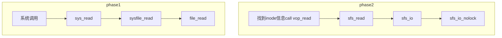

# 实验八:文件系统

**实验目的**
**通过完成本次实验,希望能达到以下目标**

- 了解基本的文件系统系统调用的实现方法;
- 了解一个基于索引节点组织方式的Simple FS文件系统的设计与实现;
- 了解文件系统抽象层-VFS的设计与实现;	

**实验内容**
实验七完成了在内核中的同步互斥实验。本次实验涉及的是文件系统,通过分析了解ucore文件系统的总体架构设
计,完善读写文件操作,从新实现基于文件系统的执行程序机制(即改写do_execve),从而可以完成执行存储在磁
盘上的文件和实现文件读写等功能。

## 练习0:填写已有实验

**本实验依赖实验1/2/3/4/5/6/7。请把你做的实验1/2/3/4/5/6/7的代码填入本实验中代码中**
**有“LAB1”/“LAB2”/“LAB3”/“LAB4”/“LAB5”/“LAB6”/“LAB7”的注释相应部分。并确保编译通过。注意:为了能够正确执行lab8的测试应用程序,可能需对已完成的实验1/2/3/4/5/6/7的代码进行进一步改进。**

```
lab1:trap.c  kdebug.c
lab2:pmm.c default_pmm.c 
lab3:swap_fifo.c vmm.c 
lab4:proc.c
lab5:proc.c pmm.c trap.c
lab6:default_shed.c
lab7:trap.c monitor.c check_sync.c
```

（心累） proc.c暂时没有修改 lab8说参考lab7写

update: 样子有点奇怪，做具体练习的时候再改

## 练习1: 完成读文件操作的实现(需要编码)

**首先了解打开文件的处理流程,然后参考本实验后续的文件读写操作的过程分析,编写在sfs_inode.c中**
**sfs_io_nolock读文件中数据的实现代码。**
**请在实验报告中给出设计实现”UNIX的PIPE机制“的概要设方案,鼓励给出详细设计方案**

### 1.1 call graph

通用文件访问接口层的处理流程



`sfs_io()`:封装进锁的`sfs_io_nolock`

```c
// sfs_read - read file
static int
sfs_read(struct inode *node, struct iobuf *iob) {
    return sfs_io(node, iob, 0);//0表示读
}


/*
 * sfs_io - Rd/Wr file. the wrapper of sfs_io_nolock
            with lock protect
 */
static inline int
sfs_io(struct inode *node, struct iobuf *iob, bool write) {
    struct sfs_fs *sfs = fsop_info(vop_fs(node), sfs);
    struct sfs_inode *sin = vop_info(node, sfs_inode);
    int ret;
    lock_sin(sin);
    {
        size_t alen = iob->io_resid;
        ret = sfs_io_nolock(sfs, sin, iob->io_base, iob->io_offset, &alen, write);
        if (alen != 0) {
            iobuf_skip(iob, alen);
        }
    }
    unlock_sin(sin);
    return ret;
}
```

`sfs_io_nolock`:

`sfs_bmap_load_nolock`:获取文件索引编号

`sfs_buf_op`:完成实际的文件读写操作

```c
//LAB8:EXERCISE1 YOUR CODE HINT: call sfs_bmap_load_nolock, sfs_rbuf, sfs_rblock,etc. read different kind of blocks in file
	/*
	 * (1) If offset isn't aligned with the first block, Rd/Wr some content from offset to the end of the first block
	 *       NOTICE: useful function: sfs_bmap_load_nolock, sfs_buf_op
	 *               Rd/Wr size = (nblks != 0) ? (SFS_BLKSIZE - blkoff) : (endpos - offset)
	 * (2) Rd/Wr aligned blocks 
	 *       NOTICE: useful function: sfs_bmap_load_nolock, sfs_block_op
     * (3) If end position isn't aligned with the last block, Rd/Wr some content from begin to the (endpos % SFS_BLKSIZE) of the last block
	 *       NOTICE: useful function: sfs_bmap_load_nolock, sfs_buf_op	
	*/
if ((blkoff = offset % SFS_BLKSIZE) != 0) {                   
    //读取第一个不是整块的数据
    size = (nblks != 0) ? (SFS_BLKSIZE - blkoff) : (endpos - offset); 
    //计算第一个数据块的大小
    if ((ret = sfs_bmap_load_nolock(sfs, sin, blkno, &ino)) != 0) {   
        //找到内存文件索引对应的block的编号ino
        goto out;
    }
	 //完成实际的读写操作
    if ((ret = sfs_buf_op(sfs, buf, size, ino, blkoff)) != 0) {   
        goto out;
    }
   
    alen += size;
    if (nblks == 0) {
        goto out;
    }
    buf += size, blkno ++, nblks --;
}

//读取中间部分的数据，将其分为size大小的块，然后一次读一块直至读完
size = SFS_BLKSIZE;
while (nblks != 0) {
    if ((ret = sfs_bmap_load_nolock(sfs, sin, blkno, &ino)) != 0) {
        goto out;
    }
    if ((ret = sfs_block_op(sfs, buf, ino, 1)) != 0) {
        goto out;
    }
    alen += size, buf += size, blkno ++, nblks --;
}
//余下不足一块的的数据
if ((size = endpos % SFS_BLKSIZE) != 0) {
    if ((ret = sfs_bmap_load_nolock(sfs, sin, blkno, &ino)) != 0) {
        goto out;
    }
    if ((ret = sfs_buf_op(sfs, buf, size, ino, 0)) != 0) {
        goto out;
    }
    alen += size;
}
```

### 1.2 请在实验报告中给出设计实现”UNIX的PIPE机制“的概要设方案，鼓励给出详细设计方案。

1. 在磁盘上保留一部分空间或者是一个特定的文件来作为pipe机制的缓冲区
2. 管道中：将进程A的标准输出作为进程B的标准输入。设置一个新的pipe_manager，包含两个进程的id，针对的目标文件，AB进程对应读写状态，并且同时生成一个临时的文件，并将其在进程A, B中打开;
3. A使用write系统调用-->pip_mm响应-->将标准输出的数据写入上方临时文件中；
4. B使用read系统调用-->pip_mm响应-->从临时文件中读取数据；

## 练习2: 完成基于文件系统的执行程序机制的实现(需要编码)

**改写proc.c中的load_icode函数和其他相关函数,实现基于文件系统的执行程序机制。执行:make qemu。如果能看看到sh用户程序的执行界面,则基本成功了。如果在sh用户界面上可以执行”ls”,”hello”等其他放置在sfs文件系统中的其他执行程序,则可以认为本实验基本成功**

### `alloc_proc `：

```c
//LAB8:EXERCISE2 YOUR CODE HINT:need add some code to init fs in proc_struct, ...
proc->filesp = NULL;//初始化进程文件指针
```

### `do_fork`:

``` c
if (copy_files(clone_flags, proc) != 0) {
        goto bad_fork_cleanup_kstack;
}//添加一句拷文件
```

### `load_icode`:

```
bss段（bss segment）通常是指用来存放程序中未初始化的全局变量的一块内存区域。
bss是英文Block Started by Symbol的简称。
bss段属于静态内存分配。 
一个程序本质上都是由 bss段、data段、text段三个组成的
```

与之前的load_icode 不同主要在于用`load_icode_read`来读取文件。并且是按块操作

```c
//argc对应参数个数，uargv[]对应参数的具体内容的地址
static int
load_icode(int fd, int argc, char **kargv) {
    assert(argc >= 0 && argc <= EXEC_MAX_ARG_NUM);
    if (current->mm != NULL) {    
        panic("load_icode: current->mm must be empty.\n");
    }

    int ret = -E_NO_MEM;// E_NO_MEM:因存储设备产生的请求错误
    struct mm_struct *mm;
    //(1)create a new mm for current process
    if ((mm = mm_create()) == NULL) {
        goto bad_mm;
    }
    //(2)建立页目录create a new PDT, and mm->pgdir= kernel virtual addr of PDT
    if (setup_pgdir(mm) != 0) {
        goto bad_pgdir_cleanup_mm;
    }
    struct Page *page;

    //(3) copy TEXT/DATA section, build BSS parts in binary to memory space of process    
    //(3)从文件加载程序到内存

    //(3.1)解析hdr read raw data content in file and resolve elfhdr
    struct elfhdr __elf, *elf = &__elf;
    if ((ret = load_icode_read(fd, elf, sizeof(struct elfhdr), 0)) != 0) {
        //读取elf文件头
        goto bad_elf_cleanup_pgdir;           
    }

    if (elf->e_magic != ELF_MAGIC) {
        // 判断该ELF文件是否合法
        ret = -E_INVAL_ELF;
        goto bad_elf_cleanup_pgdir;
    }
    //(3.2) read raw data content in file and resolve proghdr based on info in elfhdr
    //解析程序段头
    struct proghdr __ph, *ph = &__ph;
    uint32_t vm_flags, perm, phnum;
    for (phnum = 0; phnum < elf->e_phnum; phnum ++) {  
    //e_phnum代表程序段入口地址数目，即多少各段
    //循环读取程序的每个段的头部
        off_t phoff = elf->e_phoff + sizeof(struct proghdr) * phnum;  
        if ((ret = load_icode_read(fd, ph, sizeof(struct proghdr), phoff)) != 0) {
            goto bad_cleanup_mmap;
        }
        if (ph->p_type != ELF_PT_LOAD) {
            continue ;
        }
        if (ph->p_filesz > ph->p_memsz) {
            ret = -E_INVAL_ELF;
            goto bad_cleanup_mmap;
        }
        if (ph->p_filesz == 0) {
            continue ;
        }
        //(3.3) call mm_map to build vma related to TEXT/DATA
        //设置vma
        vm_flags = 0, perm = PTE_U;
        if (ph->p_flags & ELF_PF_X) vm_flags |= VM_EXEC;
        if (ph->p_flags & ELF_PF_W) vm_flags |= VM_WRITE;
        if (ph->p_flags & ELF_PF_R) vm_flags |= VM_READ;
        if (vm_flags & VM_WRITE) perm |= PTE_W;
        if ((ret = mm_map(mm, ph->p_va, ph->p_memsz, vm_flags, NULL)) != 0) {
            goto bad_cleanup_mmap;
        }
        //(3.4) callpgdir_alloc_page to allocate page for TEXT/DATA  
        //read contents in file, and copy them into the new allocated pages 
        //代码和数据段的拷贝
        off_t offset = ph->p_offset;
        size_t off, size;
        uintptr_t start = ph->p_va, end, la = ROUNDDOWN(start, PGSIZE);
        ret = -E_NO_MEM;
        //复制数据段和代码段
        end = ph->p_va + ph->p_filesz;      //计算数据段和代码段终止地址
        while (start < end) {               
            if ((page = pgdir_alloc_page(mm->pgdir, la, perm)) == NULL) {
                ret = -E_NO_MEM;
                goto bad_cleanup_mmap;
            }
            off = start - la, size = PGSIZE - off, la += PGSIZE;
            if (end < la) {
                size -= la - end;
            }
            //每次读取size大小的块，直至全部读完
            if ((ret = load_icode_read(fd, page2kva(page) + off, size, offset)) != 0) {       //load_icode_read通过sysfile_read函数实现文件读取
                goto bad_cleanup_mmap;
            }
            start += size, offset += size;
        }
        //(3.5)建立BSS段 callpgdir_alloc_page to allocate pages for BSS, memset zero in these pages        
        end = ph->p_va + ph->p_memsz;   //同样计算终止地址
        //如果先前的TEXT/DATA段分配的最后一页没有被完全占用,BSS存在
        //则剩余的部分被BSS段占用，初始化，填0
        if (start < la) {     
            if (start == end) {   
                continue ;
            }
            off = start + PGSIZE - la, size = PGSIZE - off;
            if (end < la) {
                size -= la - end;
            }
            memset(page2kva(page) + off, 0, size);//0填入
            start += size;
            assert((end < la && start == end) || (end >= la && start == la));
        }

        while (start < end) {
        //如果BSS段还需要更多的内存空间
            if ((page = pgdir_alloc_page(mm->pgdir, la, perm)) == NULL) {
            //为BSS段分配新的物理内存页
                ret = -E_NO_MEM;
                goto bad_cleanup_mmap;
            }
            off = start - la, size = PGSIZE - off, la += PGSIZE;
            if (end < la) {
                size -= la - end;
            }
            //每次操作size大小的块并填0
            memset(page2kva(page) + off, 0, size);
            start += size;
        }
    }
    sysfile_close(fd);//关闭文件，加载程序结束

    //(4)设置用户堆栈
    //(4) call mm_map to setup user stack, and put parameters into user stack
    vm_flags = VM_READ | VM_WRITE | VM_STACK;
    if ((ret = mm_map(mm, USTACKTOP - USTACKSIZE, USTACKSIZE, vm_flags, NULL)) != 0) {
        goto bad_cleanup_mmap;
    }
    assert(pgdir_alloc_page(mm->pgdir, USTACKTOP-PGSIZE , PTE_USER) != NULL);
    assert(pgdir_alloc_page(mm->pgdir, USTACKTOP-2*PGSIZE , PTE_USER) != NULL);
    assert(pgdir_alloc_page(mm->pgdir, USTACKTOP-3*PGSIZE , PTE_USER) != NULL);
    assert(pgdir_alloc_page(mm->pgdir, USTACKTOP-4*PGSIZE , PTE_USER) != NULL);
    
    //(5) setup current process's mm, cr3, reset pgidr (using lcr3 MARCO)
    //设置mm,cr3,页目录基址
    mm_count_inc(mm);
    current->mm = mm;
    current->cr3 = PADDR(mm->pgdir);
    lcr3(PADDR(mm->pgdir));

    //(6)处理用户栈中传入的参数
    uint32_t argv_size=0, i;
    for (i = 0; i < argc; i ++) {
        argv_size += strnlen(kargv[i],EXEC_MAX_ARG_LEN + 1)+1;
    }

    uintptr_t stacktop = USTACKTOP - (argv_size/sizeof(long)+1)*sizeof(long);
    char** uargv=(char **)(stacktop  - argc * sizeof(char *));

    argv_size = 0;
    for (i = 0; i < argc; i ++) {  
        //将所有参数取出来并放置uargv
        uargv[i] = strcpy((char *)(stacktop + argv_size ), kargv[i]);
        argv_size +=  strnlen(kargv[i],EXEC_MAX_ARG_LEN + 1)+1;
    }

    stacktop = (uintptr_t)uargv - sizeof(int);   //计算当前用户栈顶
    *(int *)stacktop = argc;     

    //(7)设置进程的中断帧   
    struct trapframe *tf = current->tf;     
    memset(tf, 0, sizeof(struct trapframe));
    tf->tf_cs = USER_CS;      
    tf->tf_ds = tf->tf_es = tf->tf_ss = USER_DS;
    tf->tf_esp = stacktop;
    tf->tf_eip = elf->e_entry;
    tf->tf_eflags = FL_IF;
    ret = 0;
    
    //(8)错误处理部分
out:
    return ret;
bad_cleanup_mmap:// 进行加载失败的一系列清理操作
    exit_mmap(mm);
bad_elf_cleanup_pgdir:
    put_pgdir(mm);
bad_pgdir_cleanup_mm:
    mm_destroy(mm);
bad_mm:
    goto out;
}
```

### `make grade`:

```
priority:                (15.2s)
  -check result:                             OK
  -check output:                             OK
sleep:                   (11.2s)
  -check result:                             OK
  -check output:                             OK
sleepkill:               (2.6s)
  -check result:                             OK
  -check output:                             OK
matrix:                  (8.0s)
  -check result:                             OK
  -check output:                             OK
Total Score: 190/190
```

### `make qemu`:

`ls & hello`:

```
   [-]   1(h)       11(b)    44400(s)   matrix
   [-]   1(h)       10(b)    40200(s)   softint
   [-]   1(h)       11(b)    44388(s)   priority
   [-]   1(h)       10(b)    40224(s)   exit
   [-]   1(h)       10(b)    40220(s)   sleep
   [-]   1(h)       10(b)    40344(s)   sfs_filetest1
   [-]   1(h)       10(b)    40332(s)   waitkill
   [-]   1(h)       10(b)    40204(s)   badsegment
   [-]   1(h)       10(b)    40196(s)   spin
   [-]   1(h)       10(b)    40200(s)   badarg
   [-]   1(h)       11(b)    44508(s)   sh
   [-]   1(h)       10(b)    40204(s)   faultread
   [-]   1(h)       10(b)    40200(s)   yield
   [-]   1(h)       10(b)    40228(s)   forktest
   [-]   1(h)       10(b)    40220(s)   divzero
   [-]   1(h)       10(b)    40204(s)   sleepkill
lsdir: step 4
$ hello
Hello world!!.
I am process 14.
hello pass.
```

### 请在实验报告中给出设计实现基于”UNIX的硬链接和软链接机制“的概要设方案,鼓励给出详细设计方案

```
硬链接(hard link)：
　　　　A是B的硬链接，则A的目录项中的inode节点号与B的目录项中的inode节点号相同，即一个inode节点对应两个不同的文件名，两个文件名指向同一个文件，A和B对文件系统来说是完全平等的。如果删除了其中一个，对另外一个没有影响。每增加一个文件名，inode节点上的链接数增加一，每删除一个对应的文件名，inode节点上的链接数减一，直到为0，inode节点和对应的数据块被回收。注：文件和文件名是不同的东西，rm A删除的只是A这个文件名，而A对应的数据块（文件）只有在inode节点链接数减少为0的时候才会被系统回收。

软链接(soft link)：
　　　　B是A的软链接，B的目录项中的inode节点号与B的目录项中的inode节点号不相同，A和B指向的是两个不同的inode，继而指向两块不同的数据块。但是B的数据块中存放的只是A的路径名（可以根据这个找到A的目录项）。B和A之间是“主从”关系，如果A被删除了，B仍然存在（因为两个是不同的文件），但指向的是一个无效的链接。
```

### 软链接

1. 如果在磁盘上创建一个文件A的软链接B，那么将B当成正常的文件创建inode，然后将TYPE域设置为链接，然后使用剩余的域中的一个，指向A的inode位置，然后再额外使用一个位来标记当前的链接是软链接还是硬链接；
2. 当访问到文件B，判断B是一个链接，则实际是将对B指向的文件A（已经知道了A的inode位置）进行操作；
3. 当删除一个软链接B的时候，直接将其在磁盘上的inode删掉即可；删除本体A，B依然存在，但是指向一个无效链接

### 硬链接

1. 如果对磁盘上的文件A创建一个硬链接B，那么创建B时B的目录项中inode指向和A一样的文件。并且将A中的被链接的计数加1；
2. 当删除一个硬链接B的时候，除了需要删除掉B的inode之外，还需要将B指向的文件A的被链接计数减1，如果减到了0，则需要将A删除掉；


